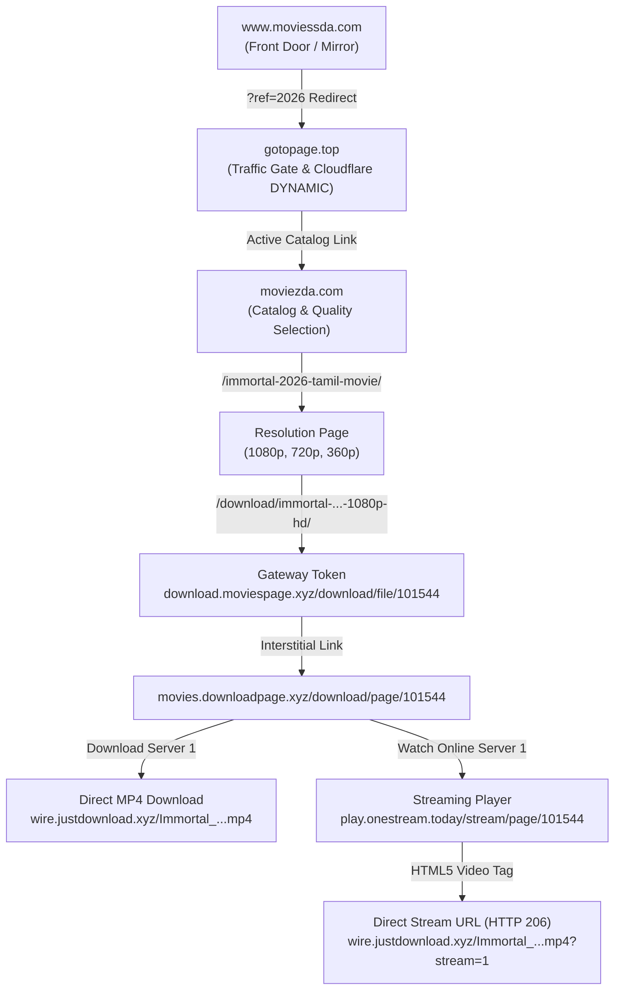

# Implementation Plan: LiquidStream - Netflix-Style App with iOS Liquid Glass UI & Moviesda Reverse Engineering

LiquidStream is a high-end Android movie streaming application built with **Kotlin** and **Jetpack Compose**. It features a modern **Apple iOS Liquid Glass** design system, full compatibility for **low-end Android devices**, extensive **UI customizations**, and a **reverse-engineered Moviesda video streaming & download engine**.

---

## 1. Deep Reverse Engineering Analysis: `https://www.moviessda.com/`

### 1.1 Architectural Flow & Multi-Hop Resolution
Our network tracing and live inspection revealed that Moviesda protects its media assets through an obfuscated multi-domain delivery network designed to defeat ISP DNS blocklists, ad-blockers, and automated scrapers:



### 1.2 Security Mechanisms & How Pure Kotlin Bypasses Them
1. **Ad-Network Popunder Scripts (`aclib.js`, `red-suspect.com`, `llvpn.com`)**:
   - Web browsers run JavaScript that hijacks user clicks and spawns pop-ups.
   - **Kotlin Advantage**: Our custom `MoviesdaScraper` uses pure OkHttp + Jsoup. Because no JavaScript execution engine runs, **100% of malicious popup scripts, redirect traps, and trackers are bypassed automatically**.
2. **Referer & Origin Validation**:
   - The media servers (`justdownload.xyz`, `moviespage.xyz`) check the `Referer` and `User-Agent` headers.
   - **Kotlin Solution**: A dedicated OkHttp `HeaderInterceptor` dynamically injects the appropriate `Referer` for each stage of the resolution chain.
3. **Session Cookies & Dynamic Cloudflare Verification**:
   - Set-Cookie headers (`SITE_TOTAL_ID`, `PHPSESSID`) are passed along hops.
   - **Kotlin Solution**: An in-memory persistent `CookieJar` in OkHttp handles seamless cookie retention across all redirects.
4. **Byte-Range Streaming (Status 206 Partial Content)**:
   - Media playback uses standard HTTP range requests (`Range: bytes=0-`). Adding query parameter `?stream=1` enables progressive seekable streaming directly in AndroidX Media3 (ExoPlayer).

---

## 2. iOS Liquid Glass UI System & Low-End Phone Strategy

### 2.1 Apple HIG Liquid Glass Paradigm
- **Content Layer vs Floating Glass Navigation**:
  - The content layer (video posters, lists, hero banners) remains rich and high-contrast.
  - The navigation layer (Top bar, bottom bar, filter chips, player HUD, action buttons) uses translucent refractive glass.
- **Visual Features**: Specular hairline border gradient, chromatic dispersion, backdrop light refraction, and fluid spring animations.

### 2.2 Three-Tier Adaptive Quality Strategy for Low-End Devices
To guarantee 60–120 FPS across flagship and budget devices (e.g. 2GB/3GB RAM or older Android versions), the app implements an automatic **3-Tier Adaptive Engine**:

| Tier | Device Target | Blur / Shader Technique | Specular Highlights | Memory Impact |
| :--- | :--- | :--- | :--- | :--- |
| **Tier 1: Ultra Liquid** | Android 12+ (API 31+), RAM > 6GB | AGSL / `RenderEffect.createBlurEffect` (25dp) + Specular refraction shader | Dynamic 2-pass gradient sheen | Standard GPU buffer |
| **Tier 2: Balanced Glass** | Android 10-11 (API 29-30) or 4-6GB RAM | Downsampled single-pass backdrop blur (12dp) | Static specular hairline border | Minimal |
| **Tier 3: Performance Fallback** | Low-RAM devices (`isLowRamDevice == true`), < 4GB RAM, or API < 29 | **Zero-Allocation Mode**: No live blur pass. Uses multi-layer translucent alpha composite (`0xCC181A20`), noise overlay, and crisp 1dp glass edge border | CSS-style linear gradient border | **Zero extra GPU/RAM overhead** |

- **User Overrides**: Under Settings, users can force any tier (Auto / Ultra / Balanced / Performance), adjust blur radius (0–40dp), and change refraction intensity.

---

## 3. Proposed Architecture & Project Structure

The project will be located in the workspace `d:\New folder (2)` under package `com.cybersec.liquidstream`:

```
d:\New folder (2)\
├── build.gradle.kts (Root Gradle script)
├── settings.gradle.kts
├── gradle/
│   └── wrapper/
├── app/
│   ├── build.gradle.kts (App dependencies: Compose BOM, Media3, OkHttp, Jsoup, Coil)
│   └── src/main/
│       ├── AndroidManifest.xml (Internet permissions, Hardware acceleration, Player activity)
│       └── java/com/cybersec/liquidstream/
│           ├── LiquidStreamApp.kt
│           ├── MainActivity.kt
│           ├── core/
│           │   ├── network/
│           │   │   ├── NetworkClient.kt (OkHttp + dynamic Referer interceptor + CookieJar)
│           │   │   └── NetworkResult.kt
│           │   ├── glass/
│           │   │   ├── LiquidGlassTheme.kt (Glass colors, borders, light/dark palettes)
│           │   │   ├── LiquidGlassModifier.kt (Compose glass modifier with 3-tier fallback)
│           │   │   ├── LiquidGlassState.kt (Auto-quality tier detector & manager)
│           │   │   └── GlassQualityTier.kt (Enum: AUTO, ULTRA, BALANCED, PERFORMANCE)
│           │   └── util/
│           │       ├── DeviceUtils.kt (Detects RAM, SoC, API level for tier selection)
│           │       └── FormatUtils.kt
│           ├── data/
│           │   ├── model/
│           │   │   ├── Movie.kt (Title, posterUrl, detailUrl, year, rating, tag)
│           │   │   ├── MovieDetail.kt (Title, synopsis, qualities: 1080p/720p/360p, file sizes)
│           │   │   ├── StreamSource.kt (Direct stream URL, download URL, headers)
│           │   │   ├── DownloadItem.kt (Download ID, progress %, status, local URI)
│           │   │   └── GlassCustomization.kt (Theme, tier, blur radius, tint color)
│           │   ├── parser/
│           │   │   └── MoviesdaScraper.kt (Reverse engineering parser for catalog, details, and direct MP4/stream links)
│           │   └── repository/
│           │       ├── MovieRepository.kt (Catalog fetching, quality resolution, link extraction)
│           │       └── DownloadRepository.kt (Android DownloadManager integration & OkHttp downloader)
│           ├── domain/
│           │   └── usecase/
│           │       ├── GetCatalogUseCase.kt
│           │       └── ResolveStreamUrlUseCase.kt
│           └── ui/
│               ├── components/
│               │   ├── LiquidGlassBox.kt (Reusable glass container)
│               │   ├── LiquidGlassNavBar.kt (Floating iOS 26 style navigation bar)
│               │   ├── LiquidGlassButton.kt (Glassmorphism interactive button)
│               │   ├── HeroMovieBanner.kt (Netflix-style featured header with glass buttons)
│               │   ├── MovieCard.kt (Poster card with glass rating badge and ripple effect)
│               │   ├── MovieRow.kt (Horizontal scrolling movie shelf)
│               │   └── CustomizationSheet.kt (Live glass customization bottom sheet)
│               ├── screens/
│               │   ├── home/
│               │   │   ├── HomeScreen.kt
│               │   │   └── HomeViewModel.kt
│               │   ├── detail/
│               │   │   ├── MovieDetailScreen.kt
│               │   │   └── MovieDetailViewModel.kt
│               │   ├── player/
│               │   │   ├── PlayerScreen.kt (ExoPlayer with Liquid Glass HUD, speed selector, skip buttons)
│               │   │   └── PlayerViewModel.kt
│               │   ├── downloads/
│               │   │   ├── DownloadsScreen.kt
│               │   │   └── DownloadsViewModel.kt
│               │   └── settings/
│               │       ├── SettingsScreen.kt (Liquid glass controls, themes, cache manager)
│               │       └── SettingsViewModel.kt
│               └── navigation/
│                   ├── Screen.kt
│                   └── AppNavHost.kt
```

---

## 4. Key Implementation Details

### 4.1 Moviesda Pure Kotlin Reverse-Engineered Scraper
- **Catalog Parser**:
  Scrapes `https://moviezda.com/moviesda-tamil-movies-{year}/?page={page}`. Extracts `<li class="movie-list-item">`, titles, poster URLs (`/uploads/posters/...`), and movie page links.
- **Detail & Quality Resolution**:
  Traverses `movieUrl` -> quality folder (`HQ PreDVD`) -> resolution folders (`1080p HD`, `720p HD`, `360p HD`) -> download page.
- **Direct Stream & Download Resolver**:
  Resolves `https://movies.downloadpage.xyz/download/page/{id}` to fetch:
  1. `Download Server 1`: `https://wire.justdownload.xyz/{filename}.mp4`
  2. `Watch Online`: `https://play.onestream.today/stream/page/{id}` -> extracts `<source src="...mp4?stream=1">`.

### 4.2 Built-in Player & Downloader
- **Player Screen**:
  Uses `androidx.media3.exoplayer.ExoPlayer` configured with custom `DefaultHttpDataSource.Factory` passing required `Referer: https://play.onestream.today/` and `User-Agent`.
  Liquid Glass overlay controls: Play/Pause, Seek bar, -10s / +10s skip, playback speed switcher (0.75x, 1x, 1.25x, 1.5x, 2x), and aspect ratio fit/fill.
- **Download Manager**:
  Supports Android's native `DownloadManager` or background OkHttp download with notification progress tracking and offline playback.

---

## 5. Verification Plan

### Automated & Build Verification
1. Verify Kotlin code syntax and compilation:
   - Gradle project setup and compilation check.
2. Verify Network Scraper Unit/Smoke Test:
   - Run a standalone Kotlin/JVM verification script in `scratch/` against the live Moviesda endpoints to confirm 100% resolution of catalog, qualities, direct stream URL (`?stream=1`), and download URL.
3. Validate Low-End Tier Fallback:
   - Ensure the Compose modifier executes without shader crashes on API < 31 and when low RAM flag is simulated.

### Manual Verification
- Review generated UI composables, Liquid Glass shaders, and state handling.
- Verify complete documentation of the Reverse Engineering findings and security architecture.
